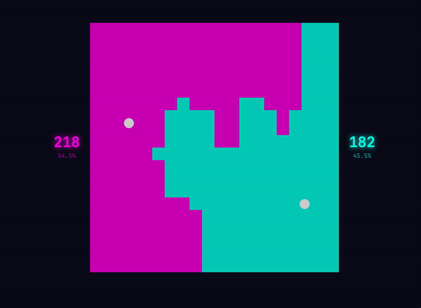

# Pong Battle

Two balls bounce inside a bounded square, each confined to its own colored territory.  
When a ball hits the boundary between the two territories, the cell flips to its color — expanding its domain.  
A deterministic, infinite tug-of-war. All spectators see the exact same game.

Inspired by [pong-wars](https://github.com/vnglst/pong-wars).

[](https://dtdg.fr/pong)

## How it works

- Seeded **deterministic** engine runs on both server and client
- Server saves state to disk every 5 s — survives restarts
- On startup, loads saved state if found, otherwise creates a new game from the seed
- Clients fetch `/api/game-state` once and simulate locally — no WebSocket needed

## Running locally

```sh
pnpm install
pnpm dev
```

Open `http://localhost:5173`.

## Docker

```sh
docker compose up --build
```

State persists in `./data/` on the host. Open `http://localhost:3000`.

## Configuration

Edit `src/lib/config.ts`:

| Option | Default | Description |
|---|---|---|
| `GRID_SIZE` | 20 | cells per side |
| `TICK_RATE` | 60 | simulation ticks per second |
| `BALL_SPEED` | 10 / TICK_RATE | cells per tick |
| `PIXEL_SIZE` | 30 | canvas pixels per cell |
| `BRIGHTNESS` | 0.8 | dim factor for canvas colors (0–1) |
| `COLORS` | synthwave | territory, ball, and glow hex colors |

## Environment variables

| Variable | Default | Description |
|---|---|---|
| `SEED` | `12345` | deterministic game seed |
| `STATE_FILE` | `data/game-state.json` | path to persisted state |
| `SAVE_INTERVAL` | `5000` | ms between state saves |
| `HOST` | `0.0.0.0` | bind address (Docker) |
| `PORT` | `3000` | listen port (Docker) |
| `BASE` | `/pong` | path prefix (build-time) |

---

Developed with the help of AI (DeepSeek V4 Pro) at a cost of $1.02.
